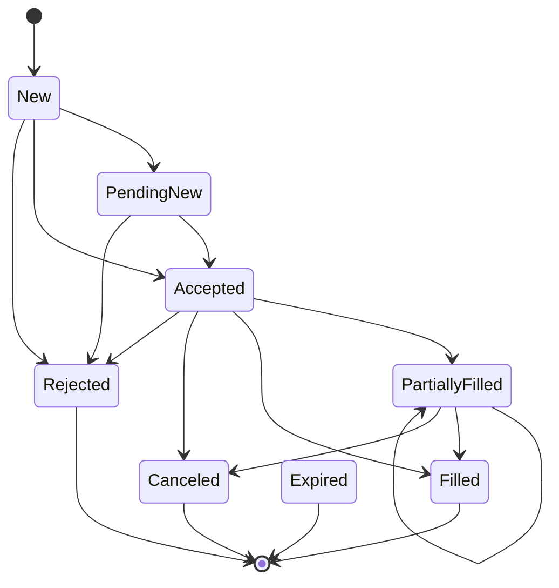

# Phase 3.2 — Order State Machine

## Objective

Replace the instant single-report execution model with a formal order lifecycle state machine. Every order now transitions through validated states (`New` → `Accepted` → `Filled`), tracked by a new `OrderTracker` component that publishes `OrderUpdateEvent` on each transition.

---

## New Components

| File | Role |
|------|------|
| `core/app/include/quant/domain/order_status.hpp` | `OrderStatus` enum — 8 lifecycle states |
| `core/app/include/quant/events/order_update_event.hpp` | `OrderUpdateEvent` — snapshot of order after state transition |
| `core/app/include/quant/risk/order_tracker.hpp` | `OrderTracker` header — state machine validator and active order book |
| `core/app/src/risk/order_tracker.cpp` | `OrderTracker` implementation |

## Modified Components

| File | Change |
|------|--------|
| `core/app/include/quant/domain/order.hpp` | Added `OrderStatus status` and `double filled_quantity` fields |
| `core/app/include/quant/events/execution_report_event.hpp` | Added `Accepted` to `ExecutionStatus` enum |
| `core/app/include/quant/events/event.hpp` | Added `OrderUpdateEvent` to the `Event` variant |
| `core/app/src/execution/mock_execution_engine.cpp` | Now publishes two reports: `Accepted` then `Filled` |
| `core/app/src/execution/execution_engine.cpp` | Same two-report sequence for consistency |
| `core/app/CMakeLists.txt` | Added `order_tracker.cpp` to `core_lib` sources |
| `core/engine/include/quant/engine/trading_engine.hpp` | Added `order_tracker_` member |
| `core/engine/src/trading_engine.cpp` | Wire `OrderTracker` in start/stop with correct ordering |
| `main.cpp` | Added `OrderUpdateEvent` logging subscriber |
| `tests/trading_engine_test.cpp` | Filter `ExecutionReportEvent` callbacks for `Filled` only |
| `tests/pipeline_integration_test.cpp` | Same `Filled`-only filter in all `ExecutionReportEvent` callbacks |

---

## Order Lifecycle State Machine

### OrderStatus Enum Values

| Status | Description | Terminal? |
|--------|-------------|-----------|
| `New` | Created by RiskEngine, not yet processed | No |
| `PendingNew` | Submitted to exchange, awaiting ack | No |
| `Accepted` | Acknowledged by execution layer | No |
| `PartiallyFilled` | Some quantity filled, remainder open | No |
| `Filled` | Fully filled | Yes |
| `Canceled` | Canceled by request | Yes |
| `Rejected` | Rejected by execution or risk | Yes |
| `Expired` | Expired due to time-in-force | Yes |

### Valid State Transitions



### transitionStatus() Validation Rules

```
Current State      → Legal Next States
─────────────────────────────────────────────
New                → PendingNew, Accepted, Rejected
PendingNew         → Accepted, Rejected
Accepted           → PartiallyFilled, Filled, Canceled, Rejected
PartiallyFilled    → PartiallyFilled, Filled, Canceled
Filled             → (none — terminal)
Canceled           → (none — terminal)
Rejected           → (none — terminal)
Expired            → (none — terminal)
```

Illegal transitions are logged to stderr and silently rejected — the order remains in its current state.

---

## Event Flow

```
OrderEvent (from RiskEngine)
       │
       ▼
 OrderTracker::onOrder()
       │
       ├── Insert order into active_orders_ (status=New)
       ├── Publish OrderUpdateEvent (New → New, initial registration)
       │
       ▼
 ExecutionEngine::onOrder()
       │
       ├── Publish ExecutionReportEvent (status=Accepted)
       │         │
       │         ▼
       │   OrderTracker::onExecutionReport()
       │         ├── Transition: New → Accepted
       │         ├── Publish OrderUpdateEvent (New → Accepted)
       │
       ├── Publish ExecutionReportEvent (status=Filled)
       │         │
       │         ▼
       │   OrderTracker::onExecutionReport()
       │         ├── Transition: Accepted → Filled
       │         ├── Set order.filled_quantity
       │         ├── Publish OrderUpdateEvent (Accepted → Filled)
       │         ├── Erase from active_orders_ (terminal state)
       │
       │   PositionEngine::onFill()
       │         ├── (Processes only Filled reports — unaffected)
       │         ├── Updates position, publishes PositionUpdateEvent
```

---

## ExecutionStatus vs OrderStatus

| Concern | Enum | Where |
|---------|------|-------|
| Wire-level execution outcome | `ExecutionStatus` | `execution_report_event.hpp` |
| Internal lifecycle tracking | `OrderStatus` | `domain/order_status.hpp` |

The `OrderTracker` maps between them:

| ExecutionStatus | → OrderStatus |
|-----------------|---------------|
| `Accepted` | `OrderStatus::Accepted` |
| `Filled` | `OrderStatus::Filled` |
| `Rejected` | `OrderStatus::Rejected` |

---

## Component Creation Order in TradingEngine::start()

```
1. DummyStrategy        (strategy_loop)
2. OrderTracker          (risk_execution_loop) — subscribes to OrderEvent first
3. PositionEngine        (risk_execution_loop) — subscribes to OrderEvent second
4. RiskEngine            (risk_execution_loop) — subscribes to SignalEvent
5. ExecutionEngine       (risk_execution_loop) — subscribes to OrderEvent last
```

Destruction order is the reverse: `ExecutionEngine` → `RiskEngine` → `PositionEngine` → `OrderTracker` → `DummyStrategy`.

This ordering guarantees:
- `OrderTracker.onOrder()` fires before `ExecutionEngine.onOrder()`, so the order is registered as `New` before any execution reports arrive.
- `PositionEngine.onOrder()` fires before `ExecutionEngine.onOrder()`, so the order cache is warm for fill processing.

## Impact on Existing Components

- **PositionEngine**: Unaffected. It already filters for `status == Filled` and ignores `Accepted` reports.
- **RiskEngine**: Unaffected. It publishes `OrderEvent` only.
- **DummyStrategy**: Unaffected. It deals with `MarketDataEvent` only.
- **Tests**: Updated to filter `ExecutionReportEvent` callbacks for `Filled` only, since execution engines now publish both `Accepted` and `Filled` reports.

## Thread Safety

`OrderTracker` lives entirely on the `risk_execution_loop` thread:
- **Construction**: main thread, before events flow.
- **Callbacks**: risk_execution_loop thread exclusively.
- **Internal state** (`active_orders_`): single-threaded access, no mutex needed.
- **`OrderUpdateEvent`**: value copy of `domain::Order`, no references to internal state.
- **`transitionStatus()`**: pure static function, safe to call from any context.
