–––# Quant Core Engine — Project Analysis & Architecture

## Implementation Status

Your project is a **production-grade C++20 event-driven trading engine**. You've built a solid foundation covering roughly **Phases 1–4** of your 6-phase roadmap. Here's where things stand:

| Phase | Area | Status | Notes |
|-------|------|--------|-------|
| **Phase 1** | Core Infrastructure | ✅ ~80% | EventBus, ThreadSafeQueue, EventLoopThread done. **Missing**: TradingEngine skeleton, async logging |
| **Phase 2** | Strategy Layer | ✅ ~60% | DummyStrategy done. **Missing**: IStrategy interface, StrategyManager |
| **Phase 3** | Risk Layer | ✅ ~40% | RiskEngine (pass-through) done. **Missing**: IRiskModule interface, RiskManager, actual risk checks (e.g. MaxPositionRisk) |
| **Phase 4** | Execution Layer | ✅ ~50% | ExecutionEngine (sim fill) + domain Order done. **Missing**: Order state machine, PositionManager |
| **Phase 5** | Broker Integration | ❌ 0% | Not started |
| **Phase 6** | Monitoring | ❌ 0% | Not started |

---

## What You've Built — File Map

### Core Infrastructure (Phase 1)

| File | Purpose |
|------|---------|
| [event_bus.hpp](file:///Users/albertalosious/Projects/quant-core-engine/core/include/quant/eventbus/event_bus.hpp) | Thread-safe pub-sub using `std::variant<Event>`. Typed `subscribe<T>` + generic subscribe. Copy-then-invoke pattern avoids deadlocks |
| [event_bus.cpp](file:///Users/albertalosious/Projects/quant-core-engine/core/src/event_bus.cpp) | Implementation of subscribe/unsubscribe/publish |
| [thread_safe_queue.hpp](file:///Users/albertalosious/Projects/quant-core-engine/core/include/quant/concurrent/thread_safe_queue.hpp) | MPMC FIFO with blocking [pop()](file:///Users/albertalosious/Projects/quant-core-engine/core/include/quant/concurrent/thread_safe_queue.hpp#71-100) and non-blocking [try_pop()](file:///Users/albertalosious/Projects/quant-core-engine/core/include/quant/concurrent/thread_safe_queue.hpp#101-126) using `std::deque` + `mutex` + `condition_variable` |
| [event_loop_thread.hpp](file:///Users/albertalosious/Projects/quant-core-engine/core/include/quant/concurrent/event_loop_thread.hpp) | Per-thread event loop: owns a `ThreadSafeQueue<Event>` + [EventBus](file:///Users/albertalosious/Projects/quant-core-engine/core/include/quant/eventbus/event_bus.hpp#27-107). Worker thread pops events and publishes to bus |
| [event_loop_thread.cpp](file:///Users/albertalosious/Projects/quant-core-engine/core/src/event_loop_thread.cpp) | Worker loop with try_pop + wait_for shutdown. 10ms poll timeout (noted for future improvement) |

### Event Types

| File | Events Defined |
|------|----------------|
| [event_types.hpp](file:///Users/albertalosious/Projects/quant-core-engine/core/include/quant/events/event_types.hpp) | [MarketDataEvent](file:///Users/albertalosious/Projects/quant-core-engine/core/include/quant/events/event_types.hpp#27-34), [SignalEvent](file:///Users/albertalosious/Projects/quant-core-engine/core/include/quant/events/event_types.hpp#43-51), [RiskRejectEvent](file:///Users/albertalosious/Projects/quant-core-engine/core/include/quant/events/event_types.hpp#63-69), [FillEvent](file:///Users/albertalosious/Projects/quant-core-engine/core/include/quant/events/event_types.hpp#78-86), [HeartbeatEvent](file:///Users/albertalosious/Projects/quant-core-engine/core/include/quant/events/event_types.hpp#95-101) |
| [order_event.hpp](file:///Users/albertalosious/Projects/quant-core-engine/core/include/quant/events/order_event.hpp) | [OrderEvent](file:///Users/albertalosious/Projects/quant-core-engine/core/include/quant/events/order_event.hpp#24-33) — wraps `domain::Order` |
| [execution_report_event.hpp](file:///Users/albertalosious/Projects/quant-core-engine/core/include/quant/events/execution_report_event.hpp) | [ExecutionReportEvent](file:///Users/albertalosious/Projects/quant-core-engine/core/include/quant/events/execution_report_event.hpp#37-48) + `ExecutionStatus` enum |
| [event.hpp](file:///Users/albertalosious/Projects/quant-core-engine/core/include/quant/events/event.hpp) | [Event](file:///Users/albertalosious/Projects/quant-core-engine/core/include/quant/eventbus/event_bus.hpp#27-107) = `std::variant<all 7 event types>` |

### Domain Model

| File | Purpose |
|------|---------|
| [order.hpp](file:///Users/albertalosious/Projects/quant-core-engine/core/include/quant/domain/order.hpp) | `domain::Order` struct + `OrderId` type alias + `domain::Side` enum |

### Strategy (Phase 2), Risk (Phase 3), Execution (Phase 4)

| File | Purpose |
|------|---------|
| [dummy_strategy.hpp](file:///Users/albertalosious/Projects/quant-core-engine/core/include/quant/strategy/dummy_strategy.hpp) / [.cpp](file:///Users/albertalosious/Projects/quant-core-engine/core/src/dummy_strategy.cpp) | Subscribes to [MarketDataEvent](file:///Users/albertalosious/Projects/quant-core-engine/core/include/quant/events/event_types.hpp#27-34), emits [SignalEvent](file:///Users/albertalosious/Projects/quant-core-engine/core/include/quant/events/event_types.hpp#43-51) if price > 0. Always buys. |
| [risk_engine.hpp](file:///Users/albertalosious/Projects/quant-core-engine/core/include/quant/risk/risk_engine.hpp) / [.cpp](file:///Users/albertalosious/Projects/quant-core-engine/core/src/risk_engine.cpp) | Subscribes to [SignalEvent](file:///Users/albertalosious/Projects/quant-core-engine/core/include/quant/events/event_types.hpp#43-51), converts to `domain::Order`, publishes [OrderEvent](file:///Users/albertalosious/Projects/quant-core-engine/core/include/quant/events/order_event.hpp#24-33). Currently **pass-through** (no actual risk checks). |
| [execution_engine.hpp](file:///Users/albertalosious/Projects/quant-core-engine/core/include/quant/execution/execution_engine.hpp) / [.cpp](file:///Users/albertalosious/Projects/quant-core-engine/core/src/execution_engine.cpp) | Subscribes to [OrderEvent](file:///Users/albertalosious/Projects/quant-core-engine/core/include/quant/events/order_event.hpp#24-33), immediately fills and publishes [ExecutionReportEvent](file:///Users/albertalosious/Projects/quant-core-engine/core/include/quant/events/execution_report_event.hpp#37-48). Simulated — no real broker. |

### Entry Point

| File | Purpose |
|------|---------|
| [main.cpp](file:///Users/albertalosious/Projects/quant-core-engine/main.cpp) | Wires 2 [EventLoopThread](file:///Users/albertalosious/Projects/quant-core-engine/core/include/quant/concurrent/event_loop_thread.hpp#40-43)s (strategy_loop, risk_execution_loop), creates all components, injects a test [MarketDataEvent](file:///Users/albertalosious/Projects/quant-core-engine/core/include/quant/events/event_types.hpp#27-34), logs output |

---

## Sequence Diagram 1 — Current Implementation (What Works Today)

This shows the **exact end-to-end event flow** when [main()](file:///Users/albertalosious/Projects/quant-core-engine/main.cpp#31-132) runs with a single market data tick:

```mermaid
sequenceDiagram
    autonumber
    box rgb(40,40,60) Main Thread
        participant Main as main()
    end
    box rgb(30,60,30) Strategy Thread
        participant SQ as strategy_loop<br/>ThreadSafeQueue
        participant SB as strategy_loop<br/>EventBus
        participant DS as DummyStrategy
    end
    box rgb(60,30,30) Risk + Execution Thread
        participant RQ as risk_exec_loop<br/>ThreadSafeQueue
        participant RB as risk_exec_loop<br/>EventBus
        participant RE as RiskEngine
        participant EE as ExecutionEngine
    end

    Note over Main: === SETUP PHASE ===
    Main->>SQ: strategy_loop.start()<br/>spawns worker thread
    Main->>RQ: risk_execution_loop.start()<br/>spawns worker thread

    Main->>SB: subscribe<SignalEvent><br/>[forwarder lambda]
    Note right of SB: Forwarder: push SignalEvent<br/>into risk_exec_loop queue

    Main->>DS: new DummyStrategy(strategy_bus)
    DS->>SB: subscribe<MarketDataEvent><br/>[onMarketData callback]

    Main->>RE: new RiskEngine(risk_exec_bus)
    RE->>RB: subscribe<SignalEvent><br/>[onSignal callback]

    Main->>EE: new ExecutionEngine(risk_exec_bus)
    EE->>RB: subscribe<OrderEvent><br/>[onOrder callback]

    Main->>RB: subscribe<SignalEvent><br/>[logger lambda]
    Main->>RB: subscribe<ExecutionReportEvent><br/>[logger lambda]

    Note over Main: === EVENT FLOW ===
    Main->>SQ: push(MarketDataEvent)<br/>symbol=AAPL, price=150.25

    Note over SQ: Worker pops from queue
    SQ->>SB: publish(MarketDataEvent)

    SB->>DS: onMarketData(event)
    Note over DS: price 150.25 > 0.0 threshold<br/>→ create SignalEvent
    DS->>SB: publish(SignalEvent)<br/>strategy=DummyStrategy<br/>symbol=AAPL, side=Buy

    SB-->>RQ: forwarder: risk_exec_loop.push(SignalEvent)
    Note over RQ: Cross-thread boundary<br/>(thread-safe queue enqueue)

    Note over RQ: Worker pops from queue
    RQ->>RB: publish(SignalEvent)

    RB->>RE: onSignal(SignalEvent)
    Note over RE: Create domain::Order<br/>id=1, symbol=AAPL<br/>side=Buy, qty=1.0
    RE->>RB: publish(OrderEvent)

    RB->>EE: onOrder(OrderEvent)
    Note over EE: Simulate immediate fill<br/>qty=1.0, price=0.0
    EE->>RB: publish(ExecutionReportEvent)<br/>status=Filled

    RB-->>Main: [logger] prints ExecutionReport<br/>order_id=1, Filled

    Note over Main: === SHUTDOWN ===
    Main->>SQ: strategy_loop.stop()
    Main->>RQ: risk_execution_loop.stop()
```

---

## Sequence Diagram 2 — Full Target Architecture & Remaining Work

This shows the **complete vision** from [architecture.md](file:///Users/albertalosious/Projects/quant-core-engine/docs/architecture.md) + [roadmap.md](file:///Users/albertalosious/Projects/quant-core-engine/docs/roadmap.md). Components highlighted with 🔲 are **not yet implemented**:

```mermaid
sequenceDiagram
    autonumber
    box rgb(20,20,50) Orchestration
        participant Main as main()
        participant TE as 🔲 TradingEngine<br/>(owns all threads)
    end
    box rgb(50,30,10) Market Data Thread
        participant MDT as 🔲 MarketData Thread
        participant MDF as 🔲 MarketDataFeed<br/>(Broker API adapter)
    end
    box rgb(30,60,30) Strategy Thread Pool
        participant SM as 🔲 StrategyManager
        participant S1 as Strategy 1<br/>(e.g. DummyStrategy)
        participant S2 as 🔲 Strategy N<br/>(IStrategy interface)
    end
    box rgb(60,30,30) Risk + Execution Thread
        participant RM as 🔲 RiskManager
        participant R1 as 🔲 MaxPositionRisk<br/>(IRiskModule)
        participant OR as 🔲 OrderRouter<br/>(Order State Machine)
        participant EE as ExecutionEngine
        participant PM as 🔲 PositionManager
    end
    box rgb(30,30,60) Infrastructure
        participant LOG as 🔲 Async Logger<br/>(dedicated thread)
        participant HB as 🔲 Heartbeat System
        participant TCP as 🔲 TCP Server<br/>(Python monitoring)
    end
    box rgb(60,50,20) External
        participant BRK as 🔲 Broker/Exchange
    end

    Note over Main,TE: === STARTUP (Phase 1 remaining) ===
    Main->>TE: TradingEngine::init()
    TE->>MDT: start MarketData thread
    TE->>SM: start Strategy thread(s)
    TE->>RM: start Risk+Exec thread
    TE->>LOG: start Logging thread
    TE->>HB: start Heartbeat system
    TE->>TCP: start TCP monitoring server

    Note over MDF,BRK: === MARKET DATA (Phase 5) ===
    BRK-->>MDF: Live market data feed
    MDF->>MDT: parse + normalize
    MDT->>SM: push(MarketDataEvent)<br/>via ThreadSafeQueue

    Note over SM,S2: === STRATEGY (Phase 2 remaining) ===
    SM->>S1: route MarketDataEvent to Strategy 1
    SM->>S2: route MarketDataEvent to Strategy N
    Note over S1: IStrategy::onMarketData()
    S1->>SM: publish(SignalEvent)
    S2->>SM: publish(SignalEvent)
    SM-->>RM: forward SignalEvents<br/>to Risk thread

    Note over RM,R1: === RISK (Phase 3 remaining) ===
    RM->>R1: IRiskModule::check(signal)
    Note over R1: Check position limits<br/>Check exposure limits<br/>Check order rate limits

    alt Risk Approved
        RM->>OR: publish(OrderEvent)
    else Risk Rejected
        RM->>SM: publish(RiskRejectEvent)<br/>→ strategy can react
    end

    Note over OR,BRK: === EXECUTION (Phases 4-5) ===
    OR->>OR: Order State Machine<br/>New→Submitted→Filled/Rejected
    OR->>BRK: 🔲 Broker API send order
    BRK-->>EE: 🔲 Async fill response
    EE->>EE: publish(ExecutionReportEvent)
    EE->>PM: publish(FillEvent)

    Note over PM: === POSITION (Phase 4 remaining) ===
    PM->>PM: Update position book<br/>Calculate PnL
    PM->>RM: Feed back positions<br/>for risk checks

    Note over LOG,TCP: === MONITORING (Phase 6) ===
    HB->>HB: Periodic HeartbeatEvent<br/>from all components
    LOG->>LOG: Async log all events
    TCP->>TCP: Stream status to<br/>Python dashboard
```

---

## What Remains to Build

### Phase 1 — Core Infrastructure (remaining ~20%)
- **`TradingEngine`** — Central orchestrator that owns all threads, manages lifecycle (init/start/stop), replaces current [main()](file:///Users/albertalosious/Projects/quant-core-engine/main.cpp#31-132) wiring
- **Async logging system** — Dedicated logging thread to avoid blocking event processing

### Phase 2 — Strategy Layer (remaining ~40%)
- **`IStrategy` interface** — Abstract base with [onMarketData()](file:///Users/albertalosious/Projects/quant-core-engine/core/src/dummy_strategy.cpp#27-53) virtual method for polymorphic strategies
- **`StrategyManager`** — Routes [MarketDataEvent](file:///Users/albertalosious/Projects/quant-core-engine/core/include/quant/events/event_types.hpp#27-34) to registered strategies, supports adding/removing strategies at runtime

### Phase 3 — Risk Layer (remaining ~60%)
- **`IRiskModule` interface** — Abstract base for pluggable risk checks
- **`RiskManager`** — Chains multiple `IRiskModule` instances, replaces current pass-through [RiskEngine](file:///Users/albertalosious/Projects/quant-core-engine/core/include/quant/risk/risk_engine.hpp#60-61)
- **`MaxPositionRisk`** — Example risk module: rejects orders exceeding position limits
- **[RiskRejectEvent](file:///Users/albertalosious/Projects/quant-core-engine/core/include/quant/events/event_types.hpp#63-69) handling** — Currently defined but never published

### Phase 4 — Execution Layer (remaining ~50%)
- **Order state machine** — Track order lifecycle: `New → Submitted → PartiallyFilled → Filled / Cancelled / Rejected`
- **`PositionManager`** — Maintain position book, calculate PnL, feed positions back to risk layer
- **[FillEvent](file:///Users/albertalosious/Projects/quant-core-engine/core/include/quant/events/event_types.hpp#78-86) handling** — Currently defined but never published (ExecutionReportEvent is used instead)

### Phase 5 — Broker Integration (0% done)
- **Broker API adapter** — Interface to connect to real exchanges (e.g. Interactive Brokers, Binance)
- **Order send logic** — Async order submission with retry/timeout
- **Fill handling** — Parse async broker responses into [FillEvent](file:///Users/albertalosious/Projects/quant-core-engine/core/include/quant/events/event_types.hpp#78-86)

### Phase 6 — Monitoring (0% done)
- **Heartbeat system** — Periodic health checks from all components
- **Status events** — Component status broadcasting
- **TCP server** — Interface for Python monitoring dashboard

### Cross-Cutting Concerns (not in roadmap but needed)
- **Configuration system** — Load strategies, risk params, broker config from files
- **Unit tests** — `tests/` directory exists but is empty
- **Replace polling with interruptible wait** — Noted in code comments as a TODO
- **Market data thread separation** — Currently [main()](file:///Users/albertalosious/Projects/quant-core-engine/main.cpp#31-132) injects data; needs dedicated thread

> [!NOTE]
> The empty subdirectories (`core/engine/`, `core/event/`, `core/execution/`, `core/marketdata/`, `core/position/`, `core/risk/`, `core/statergy/`, `core/common/`) are prepared for future module implementations matching your architectural vision.
