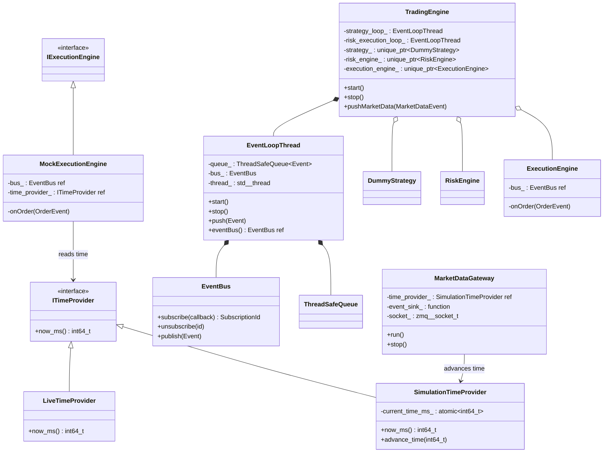
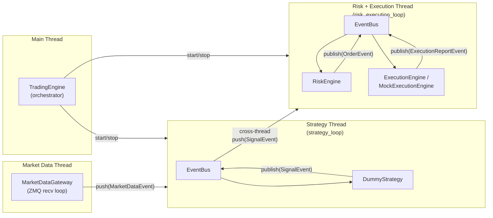

# Quant Core Engine — Implementation Overview

This document provides a detailed overview of all implemented components through Phase 2, their relationships, thread interactions, and architectural alignment.

---

## Project Structure

```text
quant-core-engine/
├── CMakeLists.txt                              # Root build: deps, executable, tests
├── main.cpp                                    # Entry point (uses TradingEngine)
├── trading_engine.md                           # Master architecture & roadmap
├── overview.md                                 # This file
│
├── core/
│   ├── CMakeLists.txt                          # Delegates to app/ and engine/
│   │
│   ├── app/                                    # core_lib — all core components
│   │   ├── CMakeLists.txt
│   │   ├── include/quant/
│   │   │   ├── concurrent/
│   │   │   │   ├── event_loop_thread.hpp       # Event loop per thread
│   │   │   │   └── thread_safe_queue.hpp       # Lock-based MPSC queue
│   │   │   ├── domain/
│   │   │   │   └── order.hpp                   # Order, OrderId, Side
│   │   │   ├── eventbus/
│   │   │   │   └── event_bus.hpp               # Pub-sub event bus
│   │   │   ├── events/
│   │   │   │   ├── event.hpp                   # Event = std::variant<...>
│   │   │   │   ├── event_types.hpp             # MarketData, Signal, Fill, etc.
│   │   │   │   ├── execution_report_event.hpp  # ExecutionReportEvent
│   │   │   │   └── order_event.hpp             # OrderEvent wrapper
│   │   │   ├── execution/
│   │   │   │   ├── i_execution_engine.hpp      # [Phase 2] Abstract interface
│   │   │   │   ├── execution_engine.hpp        # [Phase 1] Live engine
│   │   │   │   └── mock_execution_engine.hpp   # [Phase 2] Backtest engine
│   │   │   ├── gateway/
│   │   │   │   └── market_data_gateway.hpp     # [Phase 2] ZeroMQ bridge
│   │   │   ├── risk/
│   │   │   │   └── risk_engine.hpp             # Signal → Order converter
│   │   │   ├── strategy/
│   │   │   │   └── dummy_strategy.hpp          # Minimal test strategy
│   │   │   └── time/
│   │   │       ├── i_time_provider.hpp         # [Phase 2] Time interface
│   │   │       ├── live_time_provider.hpp       # [Phase 2] system_clock impl
│   │   │       ├── simulation_time_provider.hpp # [Phase 2] Atomic clock impl
│   │   │       └── time_utils.hpp              # [Phase 2] ms ↔ Timestamp
│   │   └── src/
│   │       ├── event/
│   │       │   ├── event_bus.cpp
│   │       │   └── event_loop_thread.cpp
│   │       ├── execution/
│   │       │   ├── execution_engine.cpp
│   │       │   └── mock_execution_engine.cpp   # [Phase 2]
│   │       ├── gateway/
│   │       │   └── market_data_gateway.cpp     # [Phase 2]
│   │       ├── risk/
│   │       │   └── risk_engine.cpp
│   │       ├── statergy/
│   │       │   └── dummy_strategy.cpp
│   │       └── time/
│   │           ├── live_time_provider.cpp       # [Phase 2]
│   │           └── simulation_time_provider.cpp # [Phase 2]
│   │
│   └── engine/                                 # engine_lib — orchestrator
│       ├── CMakeLists.txt
│       ├── include/quant/engine/
│       │   └── trading_engine.hpp
│       └── src/
│           └── trading_engine.cpp
│
├── tests/
│   ├── CMakeLists.txt
│   ├── thread_safe_queue_test.cpp
│   ├── event_bus_test.cpp
│   ├── pipeline_integration_test.cpp
│   └── trading_engine_test.cpp
│
└── docs/
    ├── architecture.md
    ├── development_rules.md
    ├── llm_guard_prompt.md
    ├── roadmap.md
    └── walkthrough.md
```

---

## Component Inventory

### Phase 1 Components

| Component | Header | Responsibility |
|-----------|--------|---------------|
| `EventBus` | `eventbus/event_bus.hpp` | Thread-safe publish-subscribe channel. All modules communicate via events. |
| `Event` | `events/event.hpp` | `std::variant` of all event types — the single envelope for the bus. |
| `ThreadSafeQueue<T>` | `concurrent/thread_safe_queue.hpp` | Mutex + condition_variable queue for cross-thread event passing. |
| `EventLoopThread` | `concurrent/event_loop_thread.hpp` | Owns a thread, queue, and bus. Drains queue → publishes to bus. |
| `DummyStrategy` | `strategy/dummy_strategy.hpp` | Subscribes to MarketDataEvent, emits SignalEvent. |
| `RiskEngine` | `risk/risk_engine.hpp` | Subscribes to SignalEvent, emits OrderEvent. |
| `ExecutionEngine` | `execution/execution_engine.hpp` | Subscribes to OrderEvent, emits ExecutionReportEvent (wall-clock timestamps). |
| `TradingEngine` | `engine/trading_engine.hpp` | Orchestrator: owns loops, components, lifecycle. |

### Phase 2 Components (New)

| Component | Header | Responsibility |
|-----------|--------|---------------|
| `ITimeProvider` | `time/i_time_provider.hpp` | Pure virtual interface: `now_ms() → int64_t`. Decouples time. |
| `LiveTimeProvider` | `time/live_time_provider.hpp` | Implements ITimeProvider via `std::chrono::system_clock`. |
| `SimulationTimeProvider` | `time/simulation_time_provider.hpp` | Implements ITimeProvider via `std::atomic<int64_t>`. Has `advance_time()`. |
| `time_utils` | `time/time_utils.hpp` | `ms_to_timestamp()` / `timestamp_to_ms()` conversion functions. |
| `IExecutionEngine` | `execution/i_execution_engine.hpp` | Abstract base for execution engines (virtual dtor only). |
| `MockExecutionEngine` | `execution/mock_execution_engine.hpp` | Backtest fill simulator: perfect fills using ITimeProvider for timestamps. |
| `MarketDataGateway` | `gateway/market_data_gateway.hpp` | ZeroMQ SUB socket: receives JSON ticks from Python, advances clock, pushes events. |

---

## Class Relationships



---

## Thread Model



### Thread Ownership Rules

- **Main thread**: creates TradingEngine, calls start()/stop(), pushes initial market data.
- **Strategy thread** (strategy_loop): runs DummyStrategy callbacks. Publishes SignalEvent.
- **Risk + Execution thread** (risk_execution_loop): runs RiskEngine and ExecutionEngine/MockExecutionEngine callbacks.
- **Market Data thread**: runs MarketDataGateway::run(). Pushes MarketDataEvent into strategy_loop queue.
- Cross-thread communication happens ONLY via `EventLoopThread::push()` (enqueue into ThreadSafeQueue).
- EventBus callbacks run on the thread that owns the bus (never cross-thread publish).

---

## Event Flow

### Phase 1 (Live) Pipeline

```text
MarketDataEvent
  → DummyStrategy::onMarketData()                [strategy thread]
    → publish(SignalEvent)                        [strategy thread]
      → cross-thread forwarder: push(SignalEvent) [→ risk thread queue]
        → RiskEngine::onSignal()                  [risk thread]
          → publish(OrderEvent)                   [risk thread]
            → ExecutionEngine::onOrder()          [risk thread]
              → publish(ExecutionReportEvent)      [risk thread]
```

### Phase 2 (Backtest) Pipeline

```text
Python PUB → ZMQ → MarketDataGateway::run()      [market data thread]
  → advance_time(timestamp_ms)                    [updates SimulationTimeProvider]
  → event_sink_(MarketDataEvent)                  [pushes to strategy_loop queue]
    → DummyStrategy::onMarketData()               [strategy thread]
      → publish(SignalEvent)                      [strategy thread]
        → cross-thread forwarder                  [→ risk thread queue]
          → RiskEngine::onSignal()                [risk thread]
            → publish(OrderEvent)                 [risk thread]
              → MockExecutionEngine::onOrder()    [risk thread]
                → time_provider_.now_ms()          [reads SimulationTimeProvider]
                → publish(ExecutionReportEvent)    [risk thread]
```

---

## Memory Ownership

```text
TradingEngine (value, stack/heap)
 ├── strategy_loop_          : EventLoopThread         (value member)
 │   ├── queue_              : ThreadSafeQueue<Event>  (value member)
 │   ├── bus_                : EventBus                (value member)
 │   └── thread_             : std::thread             (value member)
 │
 ├── risk_execution_loop_    : EventLoopThread         (value member)
 │   ├── queue_              : ThreadSafeQueue<Event>  (value member)
 │   ├── bus_                : EventBus                (value member)
 │   └── thread_             : std::thread             (value member)
 │
 ├── strategy_               : unique_ptr<DummyStrategy>
 │   └── bus_                : EventBus&               (reference to strategy_loop_.bus_)
 │
 ├── risk_engine_            : unique_ptr<RiskEngine>
 │   └── bus_                : EventBus&               (reference to risk_execution_loop_.bus_)
 │
 └── execution_engine_       : unique_ptr<ExecutionEngine>  (or MockExecutionEngine)
     ├── bus_                : EventBus&               (reference to risk_execution_loop_.bus_)
     └── time_provider_      : const ITimeProvider&    (reference, MockExec only)

SimulationTimeProvider       (owned externally, e.g. by backtest harness or TradingEngine)
 └── current_time_ms_       : atomic<int64_t>

MarketDataGateway            (owned externally, e.g. by backtest harness)
 ├── time_provider_          : SimulationTimeProvider&  (reference)
 ├── event_sink_             : std::function<void(Event)>
 ├── context_                : zmq::context_t          (value member)
 └── socket_                 : zmq::socket_t           (value member)
```

### Destruction Order

1. Components destroyed first (unique_ptr::reset in TradingEngine::stop) — they unsubscribe from the bus.
2. Event loops stopped second (joins threads, drains queues).
3. EventLoopThread value members destroyed in reverse declaration order.

This prevents use-after-free: no callback can fire into a destroyed component.

---

## CMake Dependency Graph

```text
quant_engine (executable)
 └── engine_lib (static library)
      └── core_lib (static library)
           ├── cppzmq (INTERFACE, header-only)
           │    └── libzmq (SHARED IMPORTED, system)
           ├── nlohmann_json::nlohmann_json (INTERFACE, header-only)
           └── Threads::Threads (system)

Tests:
 ├── thread_safe_queue_test  → core_lib, GTest
 ├── event_bus_test          → core_lib, GTest
 ├── pipeline_integration_test → core_lib, GTest
 └── trading_engine_test     → engine_lib, GTest
```

---

## Phase 2 Design Decisions Summary

| Decision | Rationale |
|----------|-----------|
| `int64_t` ms for time interface | Language-agnostic (Python JSON sends integers); avoids chrono conversion on IPC boundary. |
| `std::atomic<int64_t>` in SimulationTimeProvider | Lock-free cross-thread reads/writes; no mutex contention on hot path. |
| Pure virtual `ITimeProvider` | Dependency injection: same component code works live and simulated. |
| `IExecutionEngine` with virtual dtor only | Execution engines are event-driven (bus callbacks); no public methods needed. Enables polymorphic ownership. |
| `MockExecutionEngine` separate from `ExecutionEngine` | No Phase 1 regressions; clean separation of live vs. backtest behavior. |
| `ZMQ_RCVTIMEO` on SUB socket | Prevents indefinite recv() blocking that would hang the gateway thread during shutdown. |
| `std::function<void(Event)>` event sink | Decouples gateway from EventLoopThread; uses exact Event variant type to prevent object slicing. |
| Gateway pushes to queue, not publishes to bus | Respects thread model: callbacks must run on the loop thread, not the gateway thread. |

---

## Test Coverage

| Test Suite | Tests | Covers |
|-----------|-------|--------|
| `thread_safe_queue_test` | 7 | Queue correctness, FIFO, blocking pop, concurrency |
| `event_bus_test` | 8 | Subscribe, unsubscribe, publish, typed filtering, reentrancy |
| `pipeline_integration_test` | 4 | Cross-thread event flow, multi-event, shutdown draining |
| `trading_engine_test` | 6 | Full pipeline, idempotency, RAII, multi-event, bus accessors |
| **Total** | **25** | All pass |
